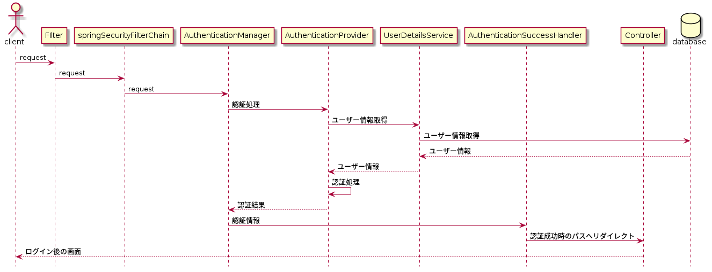

<style>
section {
    justify-content: start;
    padding: 50px
}

p {
  margin: 10px;
}

h1 {
  position: absolute;
  top: 50%;
}

img[alt="認証クラス"] {
  position: absolute;
  height: 70%;
}

img[alt="処理フロー"] {
  position: absolute;
  height: 75%;
}

p, ul, li {
  font-size: 28px;
}

</style>

# Spring Security 使い方/アーキテクチャ

---

## 話すこと
* Spring Securityとは
* Spirng Securityのアーキテクチャ
* ユーザー認証

---
## Spring Securityとは
**認証/認可**のためのフレームワークになります
そのため、これらに関する枠組み(Basic認証,ユーザー認証,など)が用意されてます
Springベースのアプリケーションでは事実上の標準です
要件に応じてある程度の拡張が可能な作りになっています

---
## Spring Securityのアーキテクチャ(1/4)


---
## Spring Securityのアーキテクチャ(2/4)
* FilerChainProxy(Spring Security Filters)
  * Spring Securityを使うと`FilterChainProxy`と呼ばれるFiltersが生成されます
  * このFiltersの中にはSpring Securityによってい用意されるFilterと、必要に応じてカスタムしたFilter含めることができます
  * 認証処理するクラス(ProviderManager)はこのFilterChainProxyにあるFilterから呼び出されます

---
## Spring Securityのアーキテクチャ(3/4)


---
## Spring Securityのアーキテクチャ(4/4)
* ProviderManger
  * 認証のためのクラスを束ねるインターフェース
  * 認証方法によって実装クラスは異なります
* AuthenticationManager
  * 認証インターフェース
  * 認証方法によって使用される数、実装クラスの種類が異なります

---
## ユーザー認証(JDBC認証)(1/7)
#### 設定方法
Java Configurationでの設定と、XML Configurationでの設定がありますが、今回はJava Configurationでの説明をします
```
@EnableWebSecurity
public class SecurityConfig extends WebSecurityConfigurerAdapter {

....

```
* `@EnableWebSecurity`をクラスに付けることでSpring Securityが有効になり、`springSecurityFilterChain`が生成されます
* FormLoginの設定のため`WebSecurityConfigurerAdapter`を拡張します
---
## ユーザー認証(JDBC認証)(2/7)
```
@RequiredArgsConstructor
@EnableWebSecurity
public class SecurityConfig extends WebSecurityConfigurerAdapter {

    private final DataSource dataSource;

    @Override
    protected void configure(AuthenticationManagerBuilder auth) throws Exception {
        auth.jdbcAuthentication().dataSource(dataSource).passwordEncoder(new BCryptPasswordEncoder());
    }
....

```
* `AuthenticationManagerBuilder`はAuthenticationManagerを生成します
* メモリ内認証、LDAP認証、JDBCベースの認証のいずれかを選択できます
* パスワードエンコーダークラスもここで指定します

---
## ユーザー認証(JDBC認証)(3/7)
#### ユーザー情報の取得
* ユーザー情報の取得は`AuthenticationProvider`から`UserDetailsService`を実装したクラスを呼び出して処理します
* デフォルトだと実装クラス(`JdbcDaoImpl`)、取得先のテーブルが決まっています

---
## ユーザー認証(JDBC認証)(4/7)

```
...
    @Override
    public void configure(WebSecurity web) throws Exception {
        web.ignoring().antMatchers("/css/**");
    }

    @Override
    protected void configure(HttpSecurity http) throws Exception {
        http.authorizeRequests().antMatchers("/**").hasAuthority("ADMIN")
                .anyRequest().permitAll()
                .and()
                .formLogin().loginPage("/login").defaultSuccessUrl("/home").permitAll()
                .and()
                .csrf().disable();
    }
}
```

---
## ユーザー認証(JDBC認証)(5/7)
* `void configure(WebSecurity web)`
  * `FilterChainProxy`生成のための設定をします
  * 静的リソースへのアクセスに認証処理をしないように設定しています
* `void configure(HttpSecurity http)`
  * リクエストに対する設定をします
  * `authorizeRequests().antMatchers("/**").hasAuthority("ADMIN")`で権限による認可設定をしています
  * formLoginのパス、ログイン成功後の遷移先なども設定します
  * 脆弱性に対する攻撃の対策をここで設定することができます(今回csrfに対して対策を無効にしています)

---
## ユーザー認証(JDBC認証)(6/7)
#### 全体の流れ


---
## ユーザー認証(JDBC認証)(7/7)
#### 認証情報
* ログイン成功後、認証情報はセッションで保持されます
  * `SecurityContext`の実装クラスのフィールド`Authentication`に存在します
  * `SecurityContextHolder`クラスを使うと取得ができます
* ログアウトすると破棄します

#### 認証失敗時
* `AuthenticationFailureHandler`の実装クラスによってハンドリングされます
* 認証失敗時にfilterが例外(`AuthenticationException`)を投げるとここに処理が遷移します
* 認証失敗時の遷移先の画面は任意に設定が可能です

---
## まとめ
* Spring Securityは認証/認可の枠組みを用意してくれます
* 認証方法がいくつかありますが、処理全体の流れは同じです
* デフォルトの設定には注意してください
  * `UserDetailsService`, 認証処理, など
* 攻撃に対する対策(クリックジャッキング、クロスサイトリクエストフォージェリなど)も用意されているので、必要に応じて利用すると良いです
  * ※対策できること/できないことがあるので注意 

---
## 参考
* *Spring Security Architecture* https://spring.io/guides/topicals/spring-security-architecture
* *Spring Security Reference* https://docs.spring.io/spring-security/site/docs/current/reference/html/
